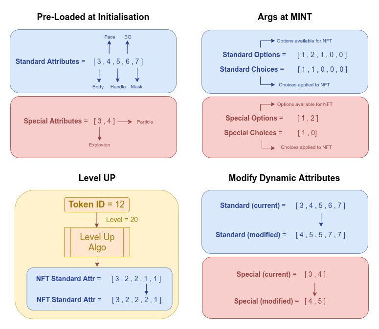

<p align="center">

</p>

# Hyperverse EVM NFT-Game

Initial Module for the Hyperverse EVM NFT Game Module

## NFT Attributes
Standard Attributes Len = 4

Special Attributes Len = 2

### Function - Mint / Tenant Mint (example)
_standardChoices = [1,1,0,0]

_standardOptions = [1,1,0,0]

_specialChoices = [0,0]

_specialOptions = [0,1]


### Function - ModifyDynamicAttribute (Called by Admin)
Standard Type = 0

Special Type = 1

_attrType = 0

_attrOptions = [3,4,5,4]

  [3,4,5,6] => [3,4,5,4]

### Function - SetDynamicAttribute (Called by player/user) 
_tokenId = 1

_attrType = 0

_attrOptions = [1,1,2,3]




## How the project is setup

1. `Contracts` - This is the first layer. Think of this as your database model and repository for how to fetch and store data
2. `Source` - Contains your javascript interface to your contracts. 
3. `Stories` - This is your UI inteterface to your smart module that allows for documentating and testing the functionality of your smarat module


## Contracts
Modules are primarily written in `solidity`. They utilize the `hardat` framework to assit in the compilation and deploying of your contracts

## Source
The javascript source connects to the smart module using `ethers` by default. The format of a Hyperverse smart module is broken down into further sub sections

1. `Library` - Lib folder contains the detailed functions that read & write to the blockchain. 
2. `useHook` - React hook that exposes your library to the react ecosystem. You'll want to rename this export to better help identify your module
3. `Provider` - Hyperverse modules use the React Context to expose state to child components
4. `Environment` - Simple component that will identify which blockchain and network your module is being used under. This allows EVM modules to easily work with any supported EVM module

# Server
In order to call write functions from a server side API you will need to provider and ethers wallet signer using a secure private key. See example with Next.js API Handler

```typescript
import { NextApiRequest, NextApiResponse } from "next";
import { NFTGameLibrary, NFTGame } from '@decentology/hyperverse-evm-nft-game'
import { Network, initialize } from '@decentology/hyperverse';
import { ethers } from 'ethers';
import { Ethereum, Localhost } from '@decentology/hyperverse-ethereum';

const hyperverse = initialize({
	blockchain: Localhost, // Switch to Ethereum when testing on Testnet
	network: Network.Testnet,
	modules: [
		{
			bundle: NFTGame,
			tenantId: '0xf39Fd6e51aad88F6F4ce6aB8827279cffFb92266',
		},
	],
});

// Get default provider for localhost when developing against storybook
const provider = ethers.getDefaultProvider('http://localhost:8545');

// Storybook Private key Account #0
const signer = new ethers.Wallet("0xac0974bec39a17e36ba4a6b4d238ff944bacb478cbed5efcae784d7bf4f2ff80", provider);

export default async function handler(req: NextApiRequest, res: NextApiResponse<{}>
) {
	const lib = await NFTGameLibrary(hyperverse, signer);
	const name = await lib.getName();
	// await lib.setMintPermissions(true);
	const mintTx = await lib.mint({
		to: '0xf39Fd6e51aad88F6F4ce6aB8827279cffFb92266',
		tokenName: 'Test Name',
		eyeId: 1,
		mouthId: 2,
		bodyId: 3,
		level: 0,
		standardChoices: [1, 1, 0, 0, 0],
		standardOptions: [1, 1, 0, 0, 0],
		specialChoices: [0, 0],
		specialOptions: [0, 0]
	});
	return res.status(200).json({
		hello: name,
		tx: mintTx.transactionHash
	});
}

```

# Documentation
For more information and learn about Hyperverse checkout the resources below

- [Hyperverse Documentation](https://docs.hyperverse.dev/)
- [Decentology YouTube Channel](https://www.youtube.com/c/Decentology)
